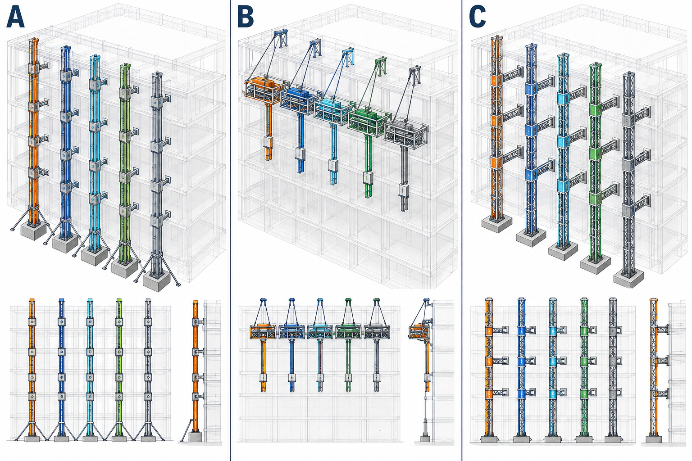
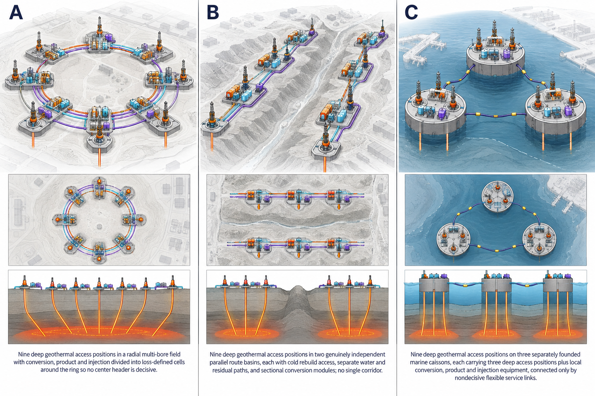
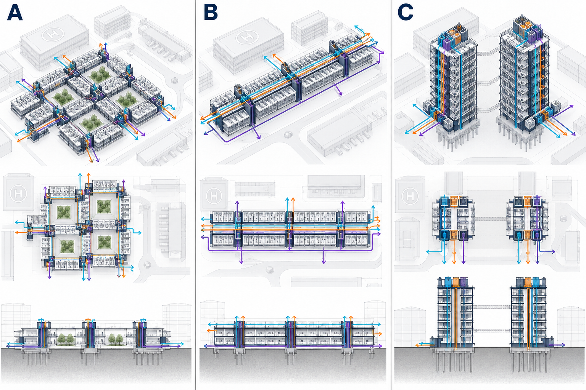
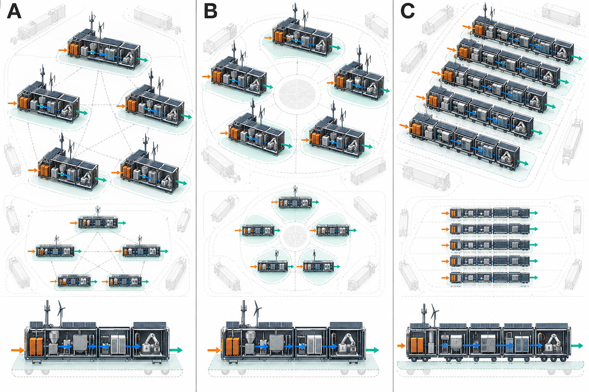

# Department of Resilience Six-Root Corrected Rival Visual Set v2 Reissuance and Lineage Audit

**Pass 223 — `RVS-3`**
**Verdict: `CLOSE`**

## Decision

The deepest active branch is `RVS`, which consumed two prior passes; this is its third of at most five. It passes the resolution test: reversal would either return fifteen known common-failure forms to the first physical portfolio or erase whole-form representation before dimensioning.

All six `REP-3 v2` records issue together. Fifteen affected hypotheses visibly implement the [Pass 222 correction orders](department-of-resilience-six-root-form-induced-contradiction-disposition-and-replacement-orders.md); three retained hypotheses remain traceable. The six v1 rasters and their failure record remain intact. A v2 image never supersedes the contradiction that caused it.

The result closes the reissuance question. Correction does not force convergence: each root still carries three materially different whole-form mechanisms. Reissuance creates no preference among them and no permission to bid, build, claim performance or produce a fleet.

## Corrected six-root set

**Plate record:** `ET-A · REP-3 · v2 · CORRECTED HYPOTHESIS · UNSELECTED · evidence 0/24`

**A:** distributed twin-body exchange · **B:** dual-chain articulated offshore spine · **C:** split-frame semi-submersible exchange lattice

Every form now carries two end-to-end wet-to-dry paths with separate load, control, dry custody, residual handling and cold-rebuild access. Stationkeeping and whole-body closure remain unresolved.

**Plate record:** `CT-C · REP-3 · v2 · CORRECTED HYPOTHESIS · UNSELECTED · evidence 0/24`

**A:** segmented telescoping utility spine · **B:** sectional suspended utility belt · **C:** mast-and-bridge insertion grid

Five trunk groups now have separate reaction and rebuild sections. The belt has independent anchor zones and structural breaks; the retained grid keeps separate bridge drops and foundations.

**Plate record:** `HC-A · REP-3 · v2 · CORRECTED HYPOTHESIS · UNSELECTED · evidence 0/24`

**A:** independent winged sector cells · **B:** independent aerostat sector cells · **C:** distributed rotorborne cells

Each of five sectors now owns its lifting body, energy, controller, sensing, delivery, custody and recovery. Wing, tether and rotor persistence remain genuinely different mechanisms.

**Plate record:** `LF-B · REP-3 · v2 · CORRECTED HYPOTHESIS · UNSELECTED · evidence 0/24`

**A:** cellular radial multi-bore field · **B:** dual-basin roadless source train · **C:** nearshore caisson source archipelago

The radial field divides headers into loss-defined cells; the linear form becomes two independent route basins; the former marine island becomes three separately founded caissons with three access positions apiece.

**Plate record:** `HU-A · REP-3 · v2 · CORRECTED HYPOTHESIS · UNSELECTED · evidence 0/24`

**A:** utility-separated clinical courtyards · **B:** sectional bypassed care spine · **C:** paired clinical metabolism towers

Utilities and residual custody disperse among isolated courts; the spine gains isolatable sections and two bypass routes; two separately founded towers each carry complete access, utilities and all indivisible care lines.

**Plate record:** `RT-B · REP-3 · v2 · CORRECTED HYPOTHESIS · UNSELECTED · evidence 0/24`

**A:** distributed container process mesh · **B:** five-petal independent clean-core ring · **C:** parallel mobile microfactory trainlets

Every visible node now contains the complete dirty-return-to-signed-release chain. The radial center is reference-only; each mobile trainlet contains its own process, energy, metrology and release ancestry.

## Lineage and representation audit

The issuance model binds each v2 plate to its v1 filename and SHA-256, the Pass 222 disposition, the inherited correction order and the unchanged evidence state. All eighteen hypothesis records are unique; every root still has three; all fifteen affected records show their correction; all six v1 records remain present.

All eighty-four root-by-view-rule decisions pass. Equal columns, camera, scale and detail prevent winner emphasis. Candidate geometry, causal paths and unresolved closure remain visually distinct. No livery, named place or dramatic mission scene appears. Each panel denotes one hypothesis, never a fleet quantity. Generated labels and apparent proportions remain orientation marks, not metrology.

The corrected PNGs total 14.2 MB. Their SHA-256 digests are:

| Root | v2 SHA-256 |
| --- | --- |
| `ET-A` | `9defa12378c96471c2fa350a256cabda84310970fe80350c0ed1c367d58415bb` |
| `CT-C` | `ed6676928dc1b869157cb72293ac810a59532ffd348ad00e1bfdc8a034e6213c` |
| `HC-A` | `f2047b4c2cb97627bfb1006a290def873841fbf03db4b6659a0b169f9a84cb92` |
| `LF-B` | `5ed319b719201ed01cdac8c51ec70d08b3a2119c72d318fdc36b8a6a346dc034` |
| `HU-A` | `c5f8af638195d873173cb83420b49f8e2d34d18ce48f504aa51d66c64364ec53` |
| `RT-B` | `ccf6d74a44ddf91a3a4ddf5b5a7565ac5df6c3555b4ab7766800f4dd9bfc3007` |

## Prompt and model boundary

The built-in image-generation tool produced the six plates. The common prompt required a neutral technical plate, three equal-salience columns, one main view plus causal insets, root-native colored paths, visibly absent or ghosted closure, no promotional scene and no measured claim. Root directives imposed the fifteen correction orders: split exchange ancestry; segmented trunk reaction and anchor zones; independent wing, aerostat and rotor sectors; cellular geothermal headers, dual route basins and three caissons; distributed clinical utilities, bypassed circulation and paired towers; complete node-local regeneration chains. `ET-A` used its v1 raster as an edit target; the other five were regenerated from their controlling specifications after edit-mode failures. The method change affects provenance, not authority.

The ten-sheet workbook contains 152 live formulas, twenty-five passing terminal checks and twelve applied-and-restored mutations after independent office recalculation. The first mutation run exposed and repaired a lineage formula that allowed a blank v2 hash. Its formula-error scan is empty and the native chart survives. SHA-256 is `e326bde5be7076401cc49995e6e7e39cadb2ffaf26f4acee3d4f6083aecf0274`.

The USD 3.59B option ceiling and USD 0.538B maximum `FRAME` share remain conserved. Incremental issuance, accepted and paid amounts remain zero. No observation, dimension, supplier, site, bid, award, capability, production or fleet state advances.

## Open-item ledger and stop condition

- **Items opened: 1.** Can each corrected form receive a root-native minimum dimension envelope and decisive-interface coordinate set without importing a common chassis, implying measured performance or exceeding the existing `FRAME` ceiling?
- **Items closed: 1.** Can the five replacement specifications and ten bounded revision orders be reissued as corrected `REP-3 v2` sets without erasing the discovered failure, creating selection or converging mechanisms? **Yes:** all six sets issue together; v1 lineage remains complete; fifteen corrections are visible; eighteen mechanisms remain unselected.
- **Net change: 0.**
- **Running total: 1.**
- **Consecutive passes without a qualifying `KILL`: 3.**

**Remaining unresolved:** root-native minimum dimension envelopes and decisive-interface coordinate sets for the eighteen corrected hypotheses.

**Authoritative:** six corrected `REP-3 v2` records, eighteen unselected hypotheses, fifteen verified corrections, complete v1 lineage and eighty-four passing view-rule decisions.

**Died:** nothing; withdrawn v1 forms remain historical records and no research branch is killed.

**Burden moved:** from causal correction to dimensioning without common-chassis convergence or false metrology.

**Parent question:** Can the five replacement specifications and ten bounded revision orders be reissued as corrected `REP-3 v2` sets without erasing the discovered failure, creating selection or converging mechanisms?
