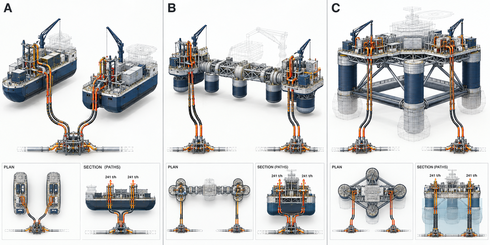
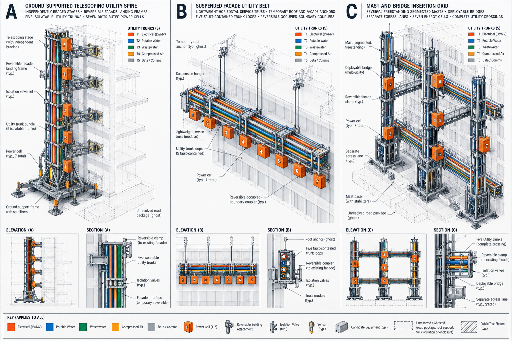
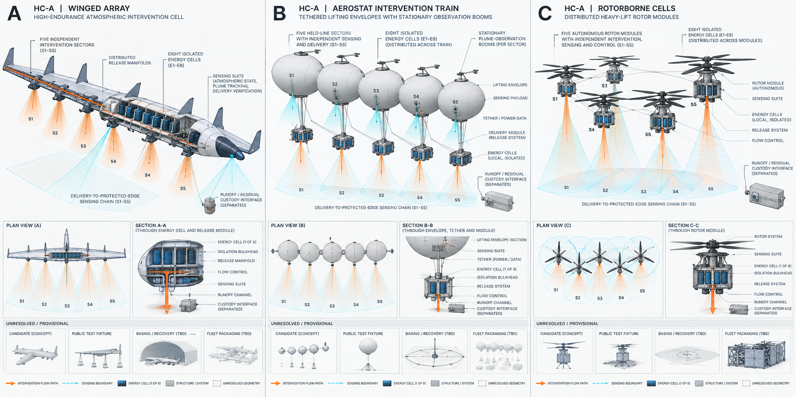
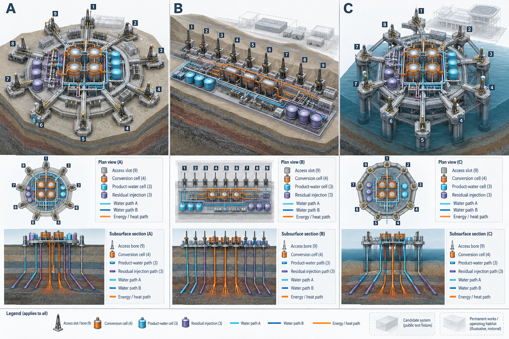
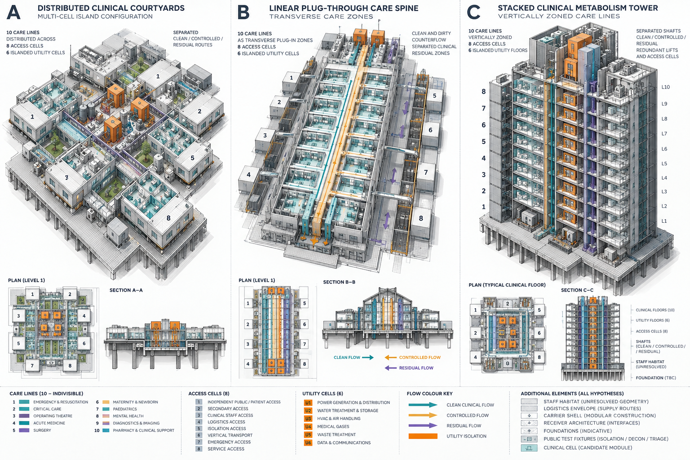
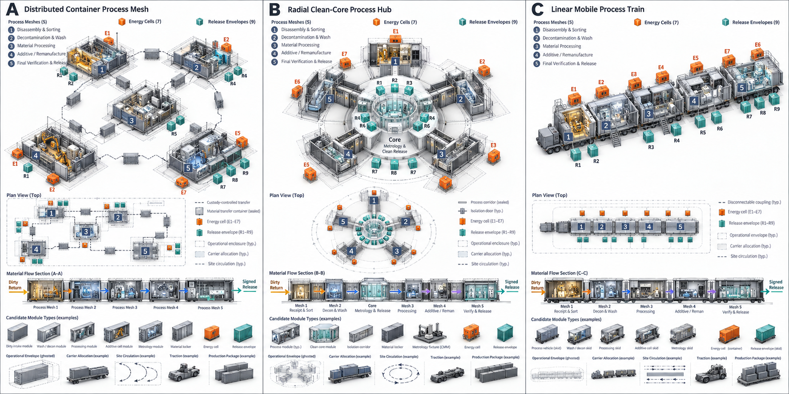

# Department of Resilience Six-Root Rival Visual Set Issuance and Audit

**Pass 221 — `RVS-1`**

**Verdict:** `CLOSE`

**Decision date:** 11 September 2026

**Scope:** first issuance of all six `REP-3` comparative technical plates; no hypothesis, exterior, firm, site, award, serial, performance, capability, production quantity or fleet is selected

## Branch position and resolution test

The deepest active branch is `RVS`; it has consumed zero prior passes, and this is its first of at most five.

If this result were reversed, the thesis would either withdraw whole-form representation entirely or permit a visually favored design to bypass the Department's first-principles acquisition architecture.

## Decision

Issue all six rival visual sets as one constitutional record. Eighteen whole-form hypotheses now become visible without becoming candidates. No single-root pilot, beauty render or preferred configuration exists.

The plates establish a useful result: the six roots do not converge on a generic “resilience vehicle.” Their form differences arise from different causal burdens—relative motion, occupied-boundary insertion, atmospheric persistence, subsurface access, clinical circulation and material ancestry. Within each root, three mechanically different forms can carry the same registered account without sharing the same topology.

The Markdown metadata, caption and raster are one artifact. A detached raster loses its root, class, version and evidence state and must be treated as unclassified illustration.

One common type and epistemic key governs every plate. Opaque navy and gray structures are assumed candidate geometry; colored paths are inherited causal requirements, not measured flows; dashed, hatched or translucent volumes are unresolved closure; and pale grids, fixtures or receivers are public test context, not candidate capacity. No visible dimension, cell number or label is an observation.

## The six issued sets

**Plate record:** `ET-A · REP-3 · v1 · HYPOTHESIS ONLY · UNSELECTED · evidence 0/24`

**A:** distributed twin-body exchange · **B:** articulated offshore spine · **C:** semi-submersible exchange lattice

The two complete exchange paths remain the visual invariant. Buoyancy separation, relative-motion accommodation and wave-response lattice are three different answers; propulsion, habitation and whole-body closure remain ghosted.

**Plate record:** `CT-C · REP-3 · v1 · HYPOTHESIS ONLY · UNSELECTED · evidence 0/24`

**A:** ground-supported telescoping spine · **B:** suspended facade utility belt · **C:** mast-and-bridge insertion grid

Five isolatable utility trunks and seven energy cells survive across reaction-from-ground, reaction-from-building and freestanding-grid hypotheses. Road package, roof support and complete circulation remain unresolved.

**Plate record:** `HC-A · REP-3 · v1 · HYPOTHESIS ONLY · UNSELECTED · evidence 0/24`

**A:** high-endurance winged array · **B:** aerostat intervention train · **C:** distributed rotorborne cells

Five attributable sectors, eight isolated energy cells and the delivery-to-protected-edge sensing chain remain visible while persistence shifts among translation, tether and distributed stationkeeping.

**Plate record:** `LF-B · REP-3 · v1 · HYPOTHESIS ONLY · UNSELECTED · evidence 0/24`

**A:** radial multi-bore field · **B:** linear roadless source train · **C:** nearshore supported source island

Nine access positions, four conversion cells, two water paths and separated product and residual trains remain invariant. The plate makes land concentration, corridor dispersion and supported nearshore access comparable without implying a chosen site.

**Plate record:** `HU-A · REP-3 · v1 · HYPOTHESIS ONLY · UNSELECTED · evidence 0/24`

**A:** distributed clinical courtyards · **B:** linear plug-through care spine · **C:** stacked clinical metabolism tower

All ten care lines, eight access cells, six utility cells and separated clean, controlled and residual paths survive three different circulation logics. Staff habitat, transport, receiver and foundation closure remain provisional.

**Plate record:** `RT-B · REP-3 · v1 · HYPOTHESIS ONLY · UNSELECTED · evidence 0/24`

**A:** distributed container process mesh · **B:** radial clean-core process hub · **C:** linear mobile process train

Five complete process meshes, seven energy cells, nine release envelopes and dirty-return-to-signed-release ancestry remain legible across distributed, radial and serial forms. Carrier allocation, traction, site circulation and production packaging remain ghosted.

## Representation audit

All eighty-four root-by-rule decisions pass. Each set contains three equal columns, matched camera and illumination, plan or elevation plus causal section, typed candidate and fixture content, visible unknowns, root-native account boundaries, no livery, no people, no named place, no dramatic mission scene, no fleet multiplicity and no observed-performance claim. Requirements and observations remain separate. None of the plates enters bid scoring or root disposition.

| Rule | Six-root result | Controlling evidence |
| --- | --- | --- |
| `VG-01` | 6/6 pass | all three rivals appear together |
| `VG-02` | 6/6 pass | equal columns, visual scale, camera, light and detail |
| `VG-03` | 6/6 pass | orthographic or plan view plus causal section |
| `VG-04` | 6/6 pass | common type key separates candidate, fixture and unresolved content |
| `VG-05` | 6/6 pass | every mark is assumed or unresolved; none is measured |
| `VG-06` | 6/6 pass | unknown closure is ghosted, dashed, hatched or separately boxed |
| `VG-07` | 6/6 pass | inseparable plate record gives root, class, version and evidence state |
| `VG-08` | 6/6 pass | causal paths and isolation boundaries are visible |
| `VG-09` | 6/6 pass | no livery, brand or promotional palette |
| `VG-10` | 6/6 pass | no people, named place or dramatic mission scene |
| `VG-11` | 6/6 pass | captions distinguish inherited requirement from zero observations |
| `VG-12` | 6/6 pass | each panel is one article hypothesis, never a fleet |
| `VG-13` | 6/6 pass | report prohibits use in bidding or disposition |
| `VG-14` | 6/6 pass | opaque surfaces carry causal geometry; other closure remains provisional |

Some labels and cell numbers are illustrative orientation marks, not metrology. Where a generated mark conflicts with the controlling Markdown record, the record governs and the image carries no quantitative authority. Only causal exterior surfaces are opaque; unresolved operational closure is ghosted or separately boxed.

## Prompt and provenance record

The six plates were generated with the built-in image-generation tool. One common prompt required a neutral engineering studio, three equal-width hypotheses, identical camera and lighting, axonometric plus sectional views, root-native causal invariants, visibly unresolved closure and the complete `VG-01` through `VG-14` avoid set. Six subject prompts supplied the eighteen forms and their inherited section bills. No external site, image, firm, product or vehicle was used as a reference.

The six PNG files total 15.3 MB. Their SHA-256 digests are:

| Root | SHA-256 |
| --- | --- |
| `ET-A` | `456969da19c41c15857493f3303ae1ef4a47da87142e702f6891d5a304d07d8f` |
| `CT-C` | `b4cc2789848e418e1c40eb64e89e3cb14cc1973a8b2ac2bb3d9d0c25dd0c11eb` |
| `HC-A` | `b0d50a284eee7911443e34c1d92019455607bd289a42ced193adcd270e6f7603` |
| `LF-B` | `464fa0bbe191a3ad785f68aa61680e8d573154b190c83633c2be92a5702dc2fe` |
| `HU-A` | `ba53efeccf63916ba2142d0899b46ac0f8dcdbbc3f4c73a9f14285c737d466d9` |
| `RT-B` | `cb8208456798b395b775061b504e1791edd5dcf3c0bd3686387e502fd1a3558e` |

Representation work creates no incremental appropriation; the USD 0.538B `FRAME` ceiling, accepted authority and paid authority remain unchanged at their Pass 220 states.

## What this changes

Pass 220's authorized-but-unissued `REP-3` state is now issued for every root. The plates reveal no forced convergence and no visual reason to kill a hypothesis. They also expose a new burden: each represented form must now be checked for contradictions created by access, isolation, residual custody, reconstruction or its unresolved envelope before any dimensioned design work.

## Open-item ledger

- Items opened: 1 — does any represented form expose a contradiction in causal independence, access, residual custody or cold reconstruction that requires a requirement change or branch kill before dimensioned design?
- Items closed: 1 — can the six authorized `REP-3` rival sets expose materially distinct whole-form hypotheses without visual selection, hidden completion or technical convergence, and should any active representation line be killed before design development proceeds? Yes, they can; all six sets issue together, all eighty-four view-rule decisions pass, none creates selection authority and no active line warrants death.
- Net change: 0
- Running total: 1
- Consecutive passes without a qualifying branch `KILL`: 1

## Remaining unresolved

- Whether form-induced contradictions require any of the eighteen hypotheses to be revised or killed before dimensioned design.

**Authoritative:** six issued `REP-3` records, eighteen unselected whole-form hypotheses and eighty-four passing root-by-view-rule decisions.

**Died:** nothing; no active hypothesis or branch is killed by representation alone.

**Burden moved:** from whether plural representation is possible to whether represented form reveals a causal contradiction requiring revision or branch death.

**Parent question:** can the six authorized `REP-3` rival sets expose materially distinct whole-form hypotheses without visual selection, hidden completion or technical convergence, and should any active representation line be killed before design development proceeds?
