# Technical Visual Atlas

**Authority:** `TVA-1`, Pass 250  
**Publication state:** issued  
**Plate set:** twenty-two of twenty-two  
**Permitted classes:** `PUB-0`, `REP-0`, `REP-1`, `REP-2`, `REP-3`  
**Held classes:** `REP-4`, `REP-5`, `REP-6`, `REP-7`

This atlas makes the Department of Resilience legible without pretending that an illustrated design has been built, measured or selected. The publication unit is the image together with its metadata block and caption. Images must not be detached from those limits.

The visual argument moves in three steps. Group A explains the national system. Group B opens six build-to-test objects and shows what would have to be measured. Group C restores rivalry: each root still has materially different ways to satisfy the same service requirement. The atlas therefore becomes more concrete as it proceeds while its claims remain deliberately bounded.

## How to read the evidence strip

- `PLANNING / RECONCILED` means the relationship agrees with the controlling manuscript and quantitative registers; it is not observed performance.
- `DESIGN / UNBUILT / UNMEASURED` means a configuration or rival architecture is sufficiently defined to construct and test, but no pictured article exists.
- `NOT AN AS-BUILT ARTICLE` bars inference to `REP-4`.
- `NO FORM SELECTED` bars inference to a candidate, procurement baseline or fleet.
- Gray dashed elements are held, unknown or not yet earned. Red denotes a hazard, prohibited conversion or fatal cut set—not generic importance.

## Group A — the strategic system

### A01 — Coequal national power

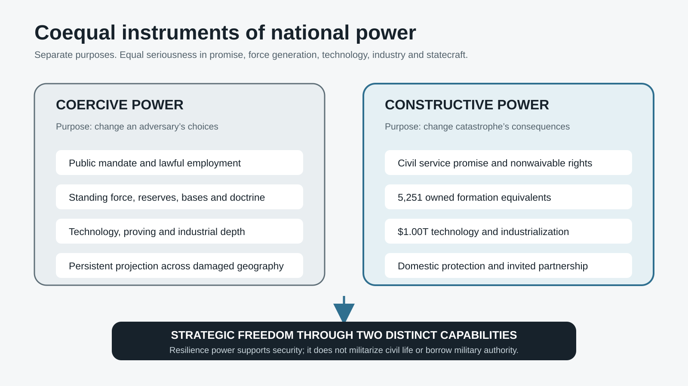

`PUB-0 · owner: integrated strategic manuscript · PLANNING / RECONCILED`  
`Requirement: make constructive power coequal in seriousness, not identical in purpose · Prohibited inference: equivalence of missions or command authorities · Source: strategic-study.md §§1–2`

The United States may maintain two force-generation establishments of comparable institutional seriousness while keeping coercive and constructive purposes separate. Coequal means durable authority, industry, people, readiness and strategic attention—not militarization of civilian service.

### A02 — The public service contract

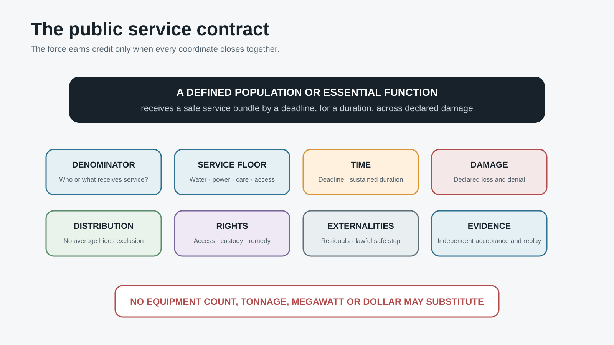

`REP-0 · owner: Public Promise House · REQUIREMENT / UNPROVEN`  
`Requirement: close every coordinate of a population-level service promise · Prohibited inference: equipment delivery equals civilian effect · Source: strategic-study.md §2`

No platform, dollar, megawatt or tonne substitutes for the denominator. Acceptance requires a named population or function, service floor, deadline, duration, damage state, distribution, rights, externality and independently reconstructable evidence.

### A03 — Five-house constitution

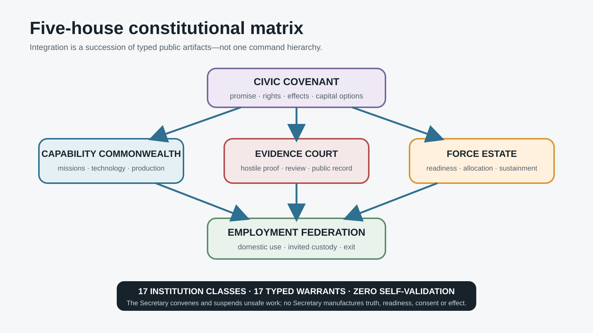

`PUB-0 · owner: National Resilience Establishment · DESIGN / UNENACTED`  
`Requirement: separate promise, creation, evidence, custody and employment · Prohibited inference: a Secretary or builder may self-validate · Source: strategic-study.md §3`

The five houses are constitutional separations, not staff directorates. Typed warrants cross their boundaries; no favorable outcome may be created by collapsing sponsor, operator, evaluator and recipient into one chain of command.

### A04 — Mature force composition

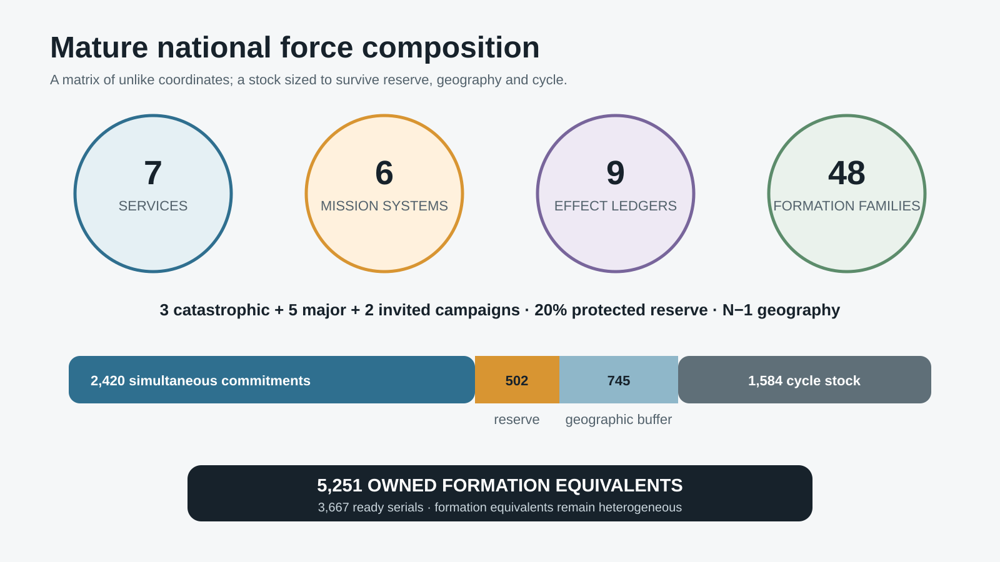

`PUB-0 · owner: Force Stewardship House · PLANNING / UNCALIBRATED`  
`Requirement: generate complete service chains at the mature campaign stress · Prohibited inference: force quantities are an appropriation or measured need · Source: strategic-study.md §4`

Seven professional services generate people and practice; six mission-system portfolios integrate complete chains; nine effect ledgers accept civilian outcomes; forty-eight formation families produce 2,420 simultaneous commitments and 5,251 owned equivalents in the mature planning screen.

### A05 — Domestic campaign

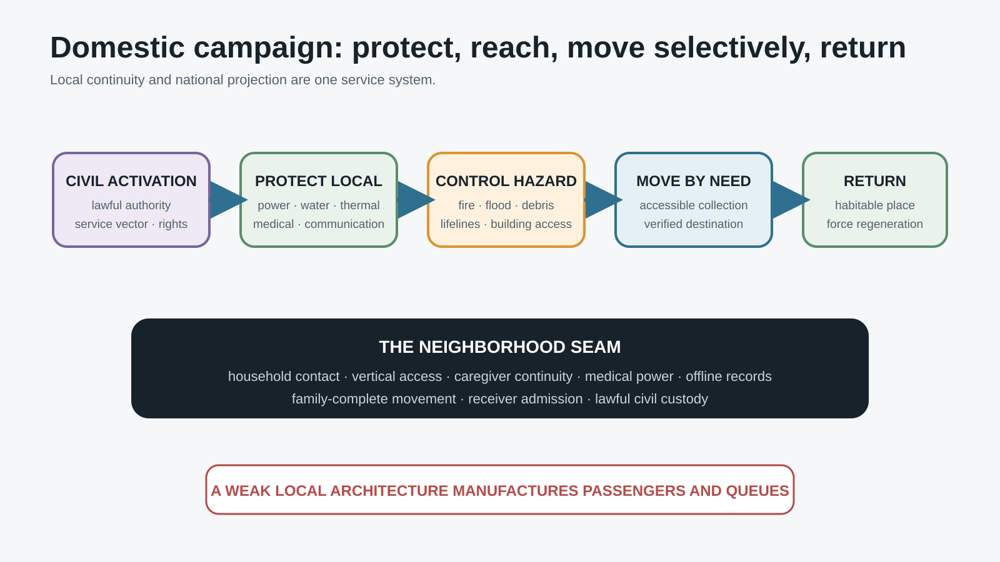

`REP-1 · owner: Force Employment House · DOCTRINE / UNEXERCISED`  
`Requirement: protect continuity before avoidable displacement and sustain accessible return · Prohibited inference: one linear sequence fits every event · Source: strategic-study.md §5`

The campaign begins with protected local continuity, then closes access, hazard, lifeline and mobility chains around real households and essential functions. Evacuation remains available, but movement is not treated as success unless reception, custody and return also close.

### A06 — Invited partnership

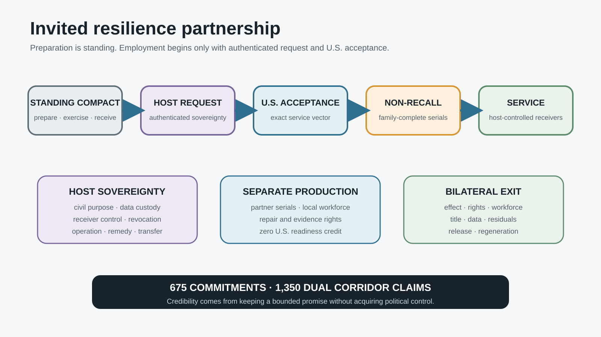

`REP-1 · owner: bilateral campaign authorities · DOCTRINE / NO TREATY`  
`Requirement: project service by invitation without coercive recall or data capture · Prohibited inference: a partner, agreement or deployment exists · Source: Invited Resilience Partnership Compact`

Standing preparation cannot self-activate a mission. Authenticated invitation and U.S. acceptance bind non-recallable commitments to host-controlled receivers, sovereign civil data, noncoercive finance, separated partner production, bilateral release and regeneration.

### A07 — Hazard-to-service matrix

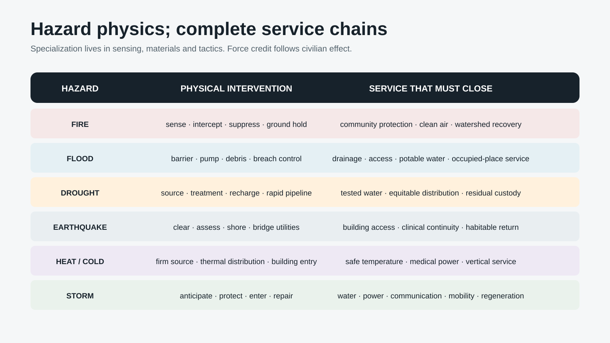

`REP-1 · owner: Capability Commonwealth · ARCHITECTURE / UNVALIDATED`  
`Requirement: map hazard physics into complete service chains · Prohibited inference: a hazard bureau can provide the whole response · Source: strategic-study.md §§6–7`

Fire, flood, drought, earthquake, heat or cold and storm create unlike physical burdens, yet none becomes a complete force unit. Specialization belongs in sensing, materials, tactics and control; employment joins those capabilities into water, power, care, access, information and continuity.

### A08 — Projection and reception

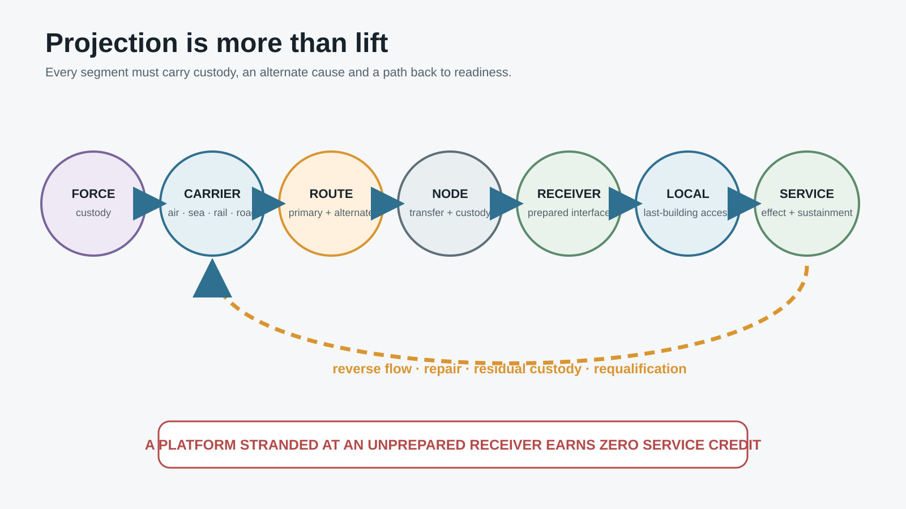

`REP-1 · owner: mission-system joint offices · ARCHITECTURE / UNVALIDATED`  
`Requirement: connect origin to receiver and preserve reverse flow and reset · Prohibited inference: transport throughput equals delivered service · Source: strategic-study.md §8`

Projection is a chain from origin through carrier and alternate route to node, prepared receiver and neighborhood distribution. People, damaged equipment, residuals and evidence must travel back. A weak receiver can nullify an extraordinary carrier.

### A09 — Technology and proof ladder

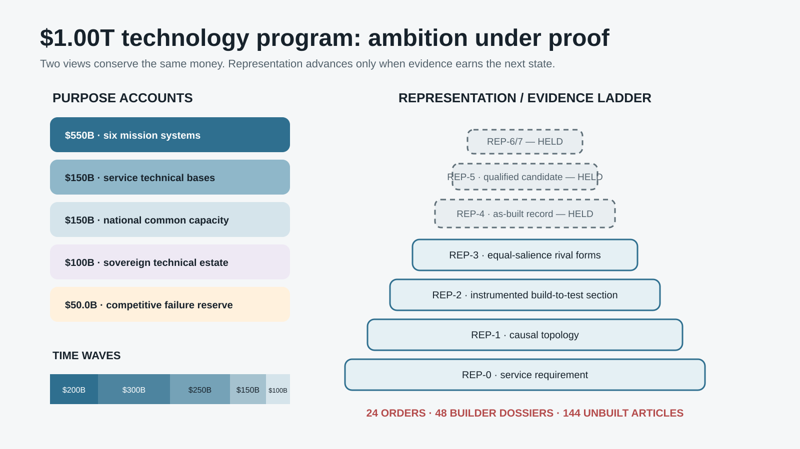

`PUB-0 · owner: Capability and Evidence houses · PROGRAMMED / UNBUILT`  
`Requirement: expose both the $1.00T purpose accounts and time waves while keeping proof states explicit · Prohibited inference: money or design maturity advances evidence · Source: strategic-study.md §9`

The same $1.00T moves through purpose-account and time-wave views; the views are not additive. Twenty-four orders, forty-eight builder-root dossiers and 144 nonfungible articles populate the first proof cohort. Only `REP-0` through `REP-3` are earned; all higher states remain held.

### A10 — Industrial, workforce and fiscal system

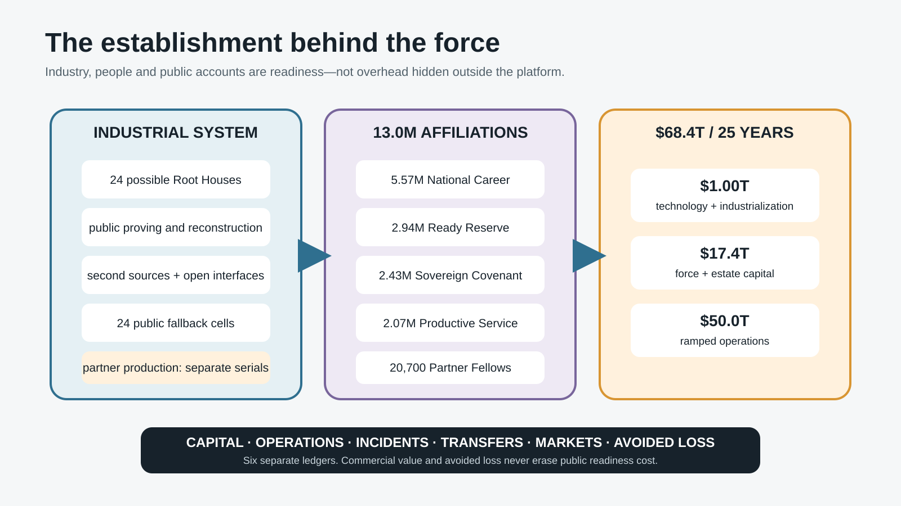

`PUB-0 · owner: integrated strategic manuscript · PLANNING / UNCALIBRATED`  
`Requirement: join industrial rivalry, sovereign fallback, workforce depth and three public accounts · Prohibited inference: commercial output finances readiness or validates the force · Source: strategic-study.md §§10–12`

Twenty-four possible Root Houses compete under public reconstruction rights and fallback capacity. Five civil statuses produce about 13.0 million affiliations. Technology, force-and-estate capital and ramped operations form the $68.4T mature planning screen; exports and avoided loss remain separate ledgers.

## Group B — root-native instrumented sections

These plates are section studies of test objects. They use the visual language of serious engineering—cutaways, access paths, flows, instrumentation and scale—because the research has reached build-to-test definition. Their geometry is illustrative. Labels below each image supply the controlling technical footer; no exterior is a selected platform.

### B01 — `ET-A-A` theater entry

`REP-2 · configuration owner: ET-A-A · DESIGN / UNBUILT / UNMEASURED`  
`Requirement: pelagic exchange through degraded anchorage to independently isolable shore service · Prohibited inference: NOT AN AS-BUILT ARTICLE · Source: EDB-TC and PIL-1`

Inspect the twin-body exchange geometry, independent heavy-service paths, modular cargo and utility cells, shore transition, anchor envelope and reverse-logistics route. The fatal questions remain shore-interface independence, heat rejection, damaged-port maneuver, service discharge under loss and custody of residuals returning seaward.

### B02 — `CT-C-B` civil terrain

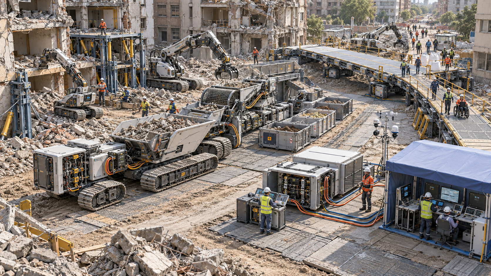

`REP-2 · configuration owner: CT-C-B · DESIGN / UNBUILT / UNMEASURED`  
`Requirement: restore accessible paths through occupied damaged ground without transferring risk to residents · Prohibited inference: NOT AN AS-BUILT ARTICLE · Source: EDB-TC and PIL-1`

Inspect the low-ground-pressure work cells, autonomous survey and material movement, manual-control stations, accessible temporary crossing, spoil custody and human exclusion boundaries. The unknowns are not merely machine productivity: they include soil variability, buried utilities, safe authority handoff, accessible gradient and where contaminated material ends.

### B03 — `HC-A-C` hazard control

`REP-2 · configuration owner: HC-A-C · DESIGN / UNBUILT / UNMEASURED`  
`Requirement: sense, interrupt and hold an atmospheric hazard under denied infrastructure · Prohibited inference: NOT AN AS-BUILT ARTICLE · Source: EDB-TC and PIL-1`

Inspect the large treatment inventory, independently isolated flow paths, wide-area sensor field, high-temperature propulsion boundary, refill interface and public ground-control chain. Governing uncertainties include plume targeting, suppressant consequence, delivery latency, crew survivability, air-ground deconfliction and contaminated-effluent custody.

### B04 — `LF-B-A` lifeline restoration

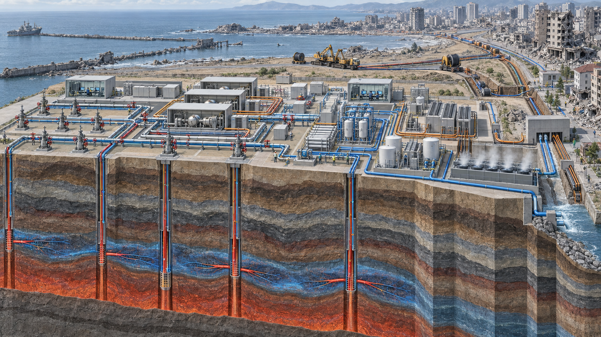

`REP-2 · configuration owner: LF-B-A · DESIGN / UNBUILT / UNMEASURED`  
`Requirement: black-start firm service into independently valved receiver branches · Prohibited inference: NOT AN AS-BUILT ARTICLE · Source: EDB-TC and PIL-1`

Inspect the firm-source field, bore and heat-rejection section, modular conversion islands, separate utility trunks, rapid pipe-and-cable deployment and receiver isolation. The active radial-header keystone has been rejected; pressure, chemistry, protection and service ownership must remain independently safeable.

### B05 — `HU-A-B` human continuity

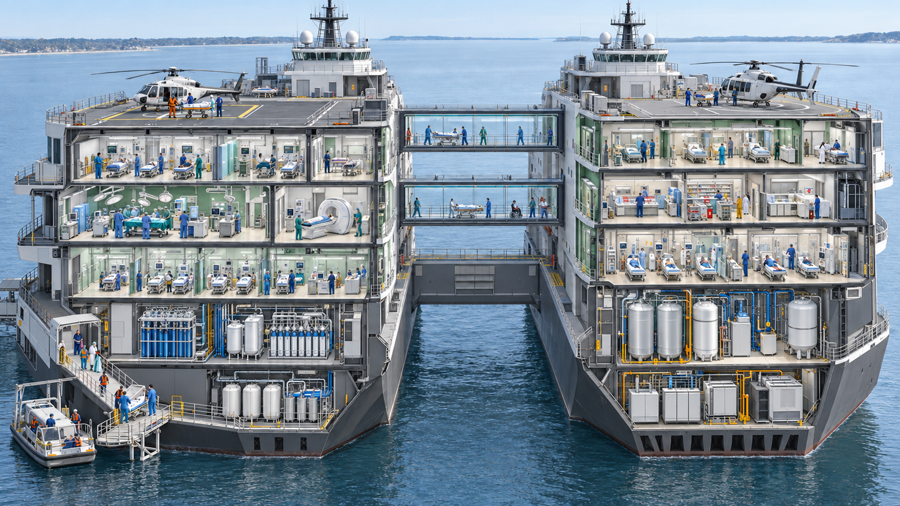

`REP-2 · configuration owner: HU-A-B · DESIGN / UNBUILT / UNMEASURED`  
`Requirement: project high-acuity care through independent clinical and utility paths · Prohibited inference: NOT AN AS-BUILT ARTICLE · Source: EDB-TC and PIL-1`

Inspect the separated clinical towers, patient and supply flows, vertical circulation, decontamination boundary, independent power-water-oxygen paths, waste route and shore reception. A first draft bearing a protected emblem was rejected. The issued image carries no affiliation mark and does not imply a real hospital, operator or protected status.

### B06 — `RT-B-C` regeneration

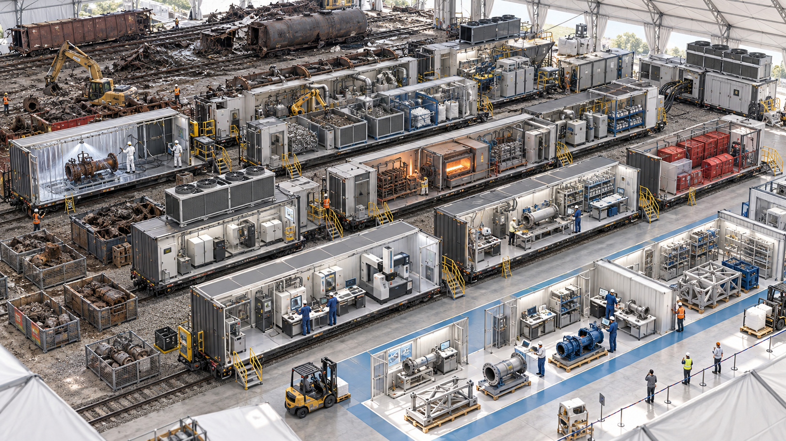

`REP-2 · configuration owner: RT-B-C · DESIGN / UNBUILT / UNMEASURED`  
`Requirement: turn damaged articles and local feedstock into qualified serviceable output while preserving ancestry · Prohibited inference: NOT AN AS-BUILT ARTICLE · Source: EDB-TC and PIL-1`

Inspect the parallel rail-compatible lines, intake quarantine, disassembly, assay, material recovery, additive and subtractive work cells, qualification, output custody and unrecoverable residual route. Production volume cannot compensate for unknown material identity or an unclosed acceptance chain.

## Group C — equal-salience rival forms

These corrected plates are reissued from the Pass 223 lineage audit. Each offers three serious hypotheses at equal scale and finish. Their exact exterior geometry is deliberately nonauthoritative; the operative comparison is draft, access, energy, control, receiver burden, failure propagation and reconstructability.

### C01 — theater entry rivals

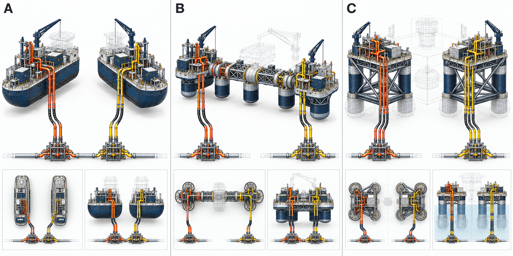

`REP-3 · owner: ET rival-root competition · DESIGN / UNBUILT / UNMEASURED`  
`Requirement: cross a damaged coast with heavy service · Prohibited inference: NO FORM SELECTED · Source: Pass 223 corrected six-root rival set`

The alternatives trade pelagic endurance, distributed exchange and shallow-water access. No central silhouette, lighting cue or scale difference identifies a winner; shore transition and receiver burden remain decisive for all three.

### C02 — civil-terrain rivals

`REP-3 · owner: CT rival-root competition · DESIGN / UNBUILT / UNMEASURED`  
`Requirement: enter occupied damaged terrain, including the last inaccessible building · Prohibited inference: NO FORM SELECTED · Source: Pass 223 corrected six-root rival set`

The alternatives emphasize direct vertical boundary insertion, distributed façade and roof access, and linked low-pressure ground work. Building access, soil access and accessible egress are parts of the same civil-terrain problem, not interchangeable machines.

### C03 — hazard-control rivals

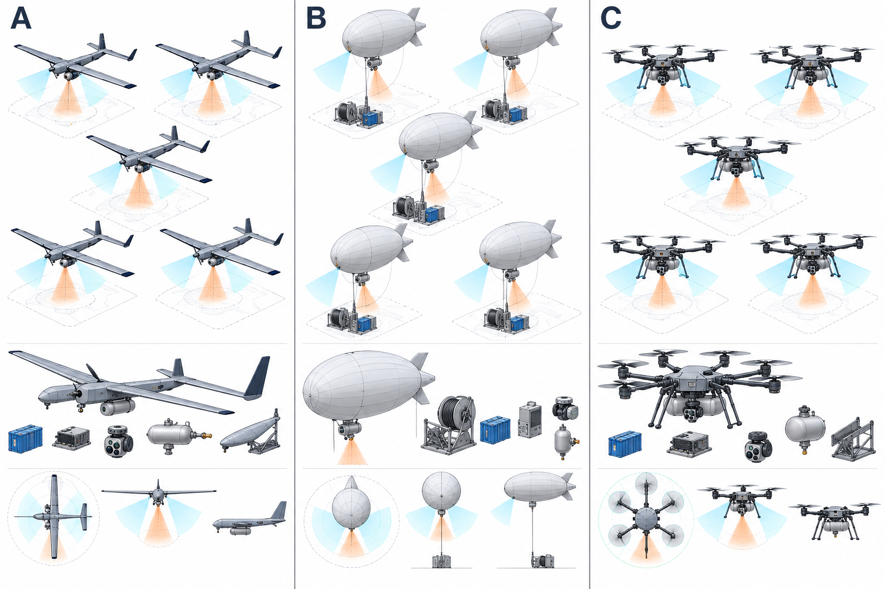

`REP-3 · owner: HC rival-root competition · DESIGN / UNBUILT / UNMEASURED`  
`Requirement: interrupt and hold an advancing atmospheric hazard · Prohibited inference: NO FORM SELECTED · Source: Pass 223 corrected six-root rival set`

Heavy crewed delivery, distributed uncrewed delivery and persistent aerostat-ground interception distribute inventory, endurance and failure differently. The image cannot decide whether any form controls fire, smoke, toxic release or another atmospheric field.

### C04 — lifeline-restoration rivals

`REP-3 · owner: LF rival-root competition · DESIGN / UNBUILT / UNMEASURED`  
`Requirement: provide firm service through broken distribution · Prohibited inference: NO FORM SELECTED · Source: Pass 223 corrected six-root rival set`

Prepared-source fields, mobile firm-energy islands and mixed source-storage lattices allocate civil works, transport, fuel, heat rejection and receiver preparation differently. “Firm” remains a service claim to prove, not a visual property.

### C05 — human-continuity rivals

`REP-3 · owner: HU rival-root competition · DESIGN / UNBUILT / UNMEASURED`  
`Requirement: project definitive care without a singular clinical spine · Prohibited inference: NO FORM SELECTED · Source: Pass 223 corrected six-root rival set`

Waterborne circulation, distributed rail care and modular land-water clinical meshes trade rapid arrival, bed depth, local access and infrastructure dependence. The familiar landing-pad `H` is generic wayfinding, not an institutional mark or operational claim.

### C06 — regeneration rivals

`REP-3 · owner: RT rival-root competition · DESIGN / UNBUILT / UNMEASURED`  
`Requirement: regenerate equipment and materials in theater · Prohibited inference: NO FORM SELECTED · Source: Pass 223 corrected six-root rival set`

Mobile foundries, distributed microfactories and receiver-anchored circular campuses trade speed, material scope, metrology depth, local labor and fixed civil burden. Each remains subordinate to feedstock identity, qualification and residual custody.

## Issue audit

| Test | Result | Basis |
|---|---|---|
| Manifest completeness | pass | ten A plates, six B plates and six C plates present |
| Eligible classes only | pass | `PUB-0` and `REP-0`–`REP-3`; no higher class issued |
| Requirement trace | pass | every plate names a controlling section or decision |
| Evidence state | pass | every publication unit states planning or design status |
| Prohibited inference | pass | all twenty-two state a nonconversion |
| Quantity reconciliation | pass | A04, A09 and A10 use the controlling 2,420, 5,251, $1.00T and $68.4T views |
| Rival salience | pass | each C plate contains three comparably scaled and finished alternatives |
| Unknown and receiver visibility | pass | captions restore the missing technical and civil boundaries |
| File integrity | pass | ten SVGs parse at 1,600 × 900; six B plates open at 1,672 × 941; C01 retains 1,774 × 887 and C02–C06 retain 1,536 × 1,024; all assets are content-hashed |
| Manuscript integration | pass | Chapter 14 points to this issued atlas |

The [generation and provenance record](technical-visual-atlas-generation-record.md) preserves the six final generation prompts, rejected B05 variant, source lineage and asset hashes. The [atlas constitution](technical-visual-atlas-constitution.md) remains controlling wherever visual appeal and representation authority conflict.

## What the atlas does not establish

No pictured article exists. No instrument has accepted data. No rival form has won. No production line, fleet, partner deployment, response effect or calibrated cost is shown. The atlas closes a publication burden: the mature hypothesis can now be seen and challenged at the same resolution at which it is argued. The next burden is physical proof, not a more confident picture.
